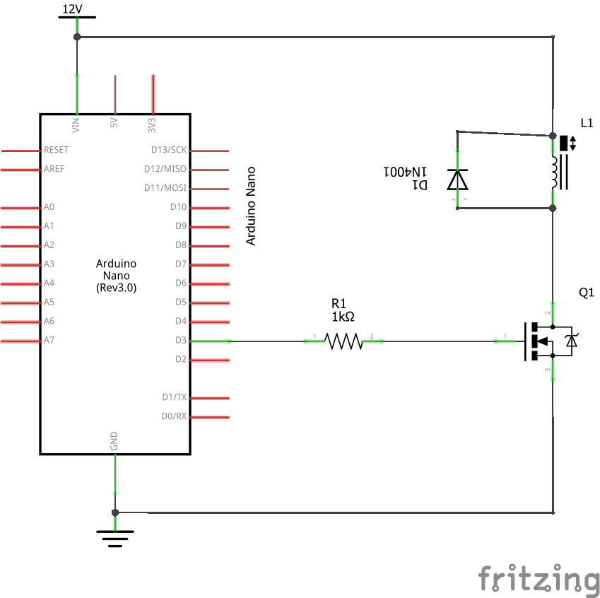
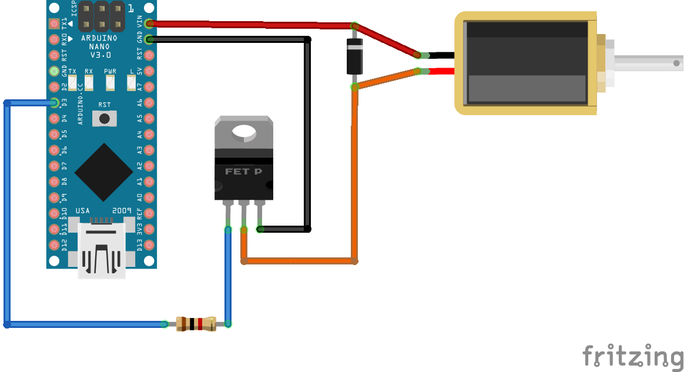

# Magnetic valve control

This project is about controlling a magnetic valve to automate the watering of my garden. The magnetic valve is connected on both sides to some tubing of my Gardena Microdrip system. The valve should control part of the tube system and turn on the watering every evening. I have 3D printed the adapters for connecting the 4.6 mm Gardena Microdrip tube to the magnetic valve and added some gaskets to make it water tight. The magnetic valve is turned on and off by a MOSFET transistor acting as switch. The transistor is controlled again by an Arduino Nano. The trigger of the Arduino is scheduled to happen every evening. For keeping the right time even in case of power outage, the Arduino Nano is connected to a real time clock (RTC) module which saves the time.

# Bill of materials

* Arduino Nano
* DS3231 RTC module
* [IRF 520 MOSFET transistor](https://www.vishay.com/docs/91017/91017.pdf) (or similar)
* 1 kOhm resistor
* [1N4001 diode](https://www.onsemi.com/pdf/datasheet/1n4001-d.pdf) (or similar)
* magnetic solenoid valve, 12 V
* DC power supply, 12 V, 800 mA

# Circuit setup

The following picture shows the schematic of the circuit. The resistor R1 limits the current from the Arduino to the transistor and protects both components. The diode D1 protects the solenoid (the magnetic valve) from the peak of the induced inverse voltage when the solenoid switching off.

The following picture shows the illustration of the circuit. Please note that the 12 V power supply is not illustrated and should be connected to the red and black wires.

